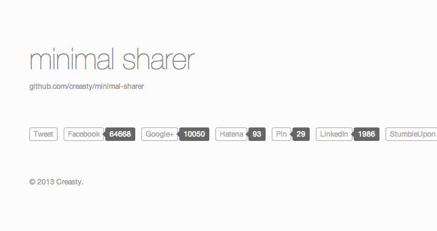

# minimal sharer

ミニマルなデザインでカスタマイズしやすい、ソーシャルボタンプラグイン。  
[サンプル](example/index.html)




# Quick Start

OGP が設定されたサイトだと、必要なコードはこれだけです。

```html
<ul id="share" class="minimal-sharer"></ul>
<script>
	$(function () {
		$('#share').minimalSharer({
			buttons: {
				'twitter': 'Tweet',
				'facebook': 'Facebook',
				'hatena': 'Hatena',
				'pinterest': 'Pin'
			}
		});
	});
</script>
```


# コンフィグ

<table>
	<tr>
		<th>キー</th>
		<th>型</th>
		<th>説明</th>
	</tr>
	<tr>
		<td><code>buttons</code></td>
		<td>Object</td>
		<td>
			<strong>表示するソーシャルボタン</strong>
			<br /><code>'<em>ボタン</em>': '<em>表示名</em>'</code> のペアで指定する。
			<br />利用可能なボタンのについては下記を参照。
		</td>
	</tr>
	<tr>
		<td><code>url</code></td>
		<td>String</td>
		<td>
			<strong>シェアするリンク</strong>
			<br />設定しなければ、以下の順番で自動的に設定。
			<ol>
				<li>OGP の &lt;meta property="og::url" content="" /&gt; の値</li>
				<li>&lt;meta name="canonical" content="" /&gt; の値</li>
				<li>表示しているページの URL (window.location.href)</li>
				<li><code>''</code></li>
			</ol>
		</td>
	</tr>
	<tr>
		<td><code>title</code></td>
		<td>String</td>
		<td>
			<strong>タイトル</strong>
			<br />設定しなければ、以下の順番で自動的に設定。
			<ol>
				<li>OGP の &lt;meta property="og::title" content="" /&gt; の値</li>
				<li>表示しているページのタイトル (&lt;title&gt;)</li>
				<li><code>''</code></li>
			</ol>
		</td>
	</tr>
	<tr>
		<td><code>site</code></td>
		<td>String</td>
		<td>
			<strong>サイトの名前</strong>
			<br />(オプショナル: Evernote のボタンを表示させるときは必須)
			<br />設定しなければ、以下の順番で自動的に設定。
			<ol>
				<li>OGP の &lt;meta property="og::site_name" content="" /&gt; の値</li>
				<li><code>''</code></li>
			</ol>
		</td>
	</tr>
	<tr>
		<td><code>script</code></td>
		<td>String</td>
		<td>
			<strong>付属の PHP スクリプトへのパス</strong>
			<br />(オプショナル)
			<br />以下のカウント数を表示させるときは必須。
			<br />ボタンのみを表示させる場合は必要ない
			<ul>
				<li>Google Plus</li>
				<li>LinkedIn</li>
				<li>StumbleUpon</li>
			</ul>
		</td>
	</tr>
	<tr>
		<td><code>lang</code></td>
		<td>String</td>
		<td>
			<strong>サイトの言語</strong>
			<br />(オプショナル)
			<br />設定しなければ、以下の順番で自動的に設定。
			<ol>
				<li>OGP の &lt;html&gt; タグの lang 属性</li>
				<li><code>'ja'</code> (日本語)</li>
			</ol>
		</td>
	</tr>
	<tr>
		<td><code>twitter</code></td>
		<td>String</td>
		<td>
			<strong>ツイッターのアカウント</strong>
			<br />(オプショナル)
			<br /><code>@</code> 付きでも、無くても OK。
			<br />設定しなければ、以下の順番で自動的に設定。
			<ol>
				<li>Twitter Card の &lt;meta name="twitter::site_name" content="" /&gt; の値</li>
				<li><code>''</code></li>
			</ol>
		</td>
	</tr>
</table>


## 利用可能なボタン

1. `'twitter'` - Twitter でシェア **(カウンター無し)**
2. `'facebook'` - Facebook でシェア
3. `'gplus'` - Google Plus でシェア
4. `'hatena'` - はてなブックマークに登録
5. `'pinterest'` - Pinterest で pin
6. `'linkedin'` - LinkedIn でシェア
7. `'stumble'` - StumbleUpon でシェア
8. `'tumblr'` - Tumblr でシェア (カウンター無し)
9. `'evernote'` - Evernote へクリップ (カウンター無し)
10. `'mail'` - メールで送信 (カウンター無し)


# まとめ

	$('#share').minimalSharer({
		// 付属の PHP スクリプトへのパス
		script: '../dist/counter.php',

		// シェアするリンク
		url: 'http://www.example.com/',

		// タイトル
		title: 'ページのタイトル',

		// サイトの名前 (オプション)
		site: '',

		// サイトの言語 (オプション)
		lang: 'ja',

		// ツイッターのアカウント
		twitter: 'builtlast',

		// 表示するボタン
		buttons: {
			'twitter': 'ツイート',
			'facebook': 'シェア',
			'gplus': 'ぐぐたす',
			'hatena': 'はてぶ',
			'pinterest': 'Pin する',
			'linkedin': 'LinkedIn',
			'stumble': 'StumbleUpon',
			'tumblr': 'Tumblr',
			'evernote': 'Evernote',
			'mail': 'メールで送信'
		}
	});


# License

MIT

